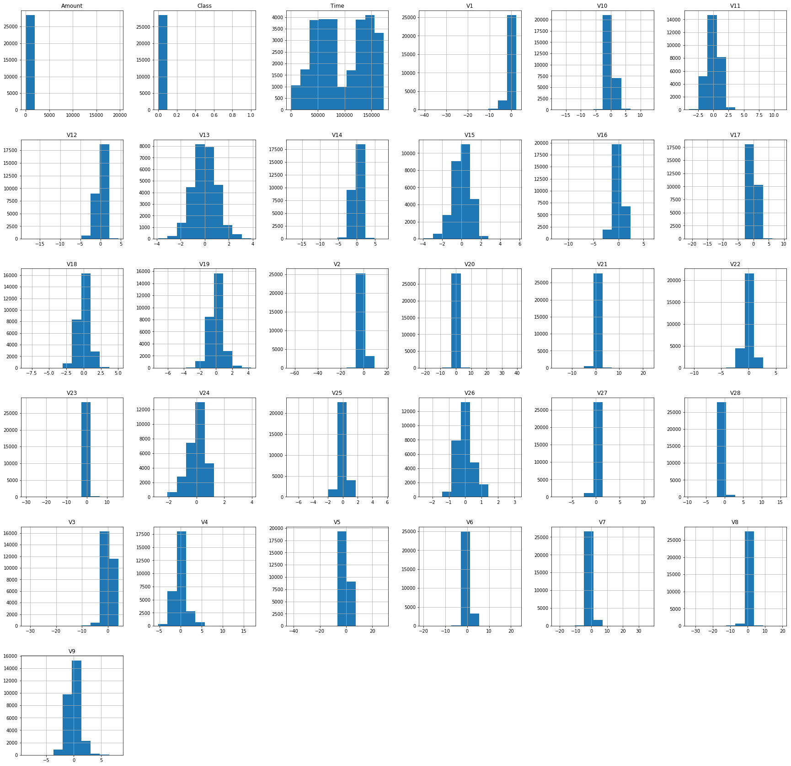

```python
import sys
import numpy
import pandas
import matplotlib
import seaborn
import scipy
import sklearn

## Verifying Packages & Versions
print('Python: {}'.format(sys.version))
print('Numpy: {}'.format(numpy.__version__))
print('Pandas: {}'.format(pandas.__version__))
print('Matplotlib: {}'.format(matplotlib.__version__))
print('Seaborn: {}'.format(seaborn.__version__))
print('Scipy: {}'.format(scipy.__version__))
print('Sklearn: {}'.format(sklearn.__version__))
```

    Python: 3.7.4 (default, Sep  7 2019, 18:27:02) 
    [Clang 10.0.1 (clang-1001.0.46.4)]
    Numpy: 1.16.0
    Pandas: 0.24.0
    Matplotlib: 3.0.2
    Seaborn: 0.9.0
    Scipy: 1.2.0
    Sklearn: 0.20.2


```python
# Import packages
import numpy as np
import pandas as pd
import matplotlib.pyplot as plt
import seaborn as sns
```


```python
# Read CSV file that contains credit card information using pandas
dataset = pd.read_csv('https://s3-us-west-2.amazonaws.com/strikedataset/creditcard.csv')
```


```python
# Check total number of records in the file
print(dataset.shape) # This will output a tuple with (total_records_count, total_columns_count)
```

    (284807, 31)


```python
# exploring the details [This may take some time due to the amount of data]
print(dataset.columns) 
```

    Index(['Time', 'V1', 'V2', 'V3', 'V4', 'V5', 'V6', 'V7', 'V8', 'V9', 'V10',
           'V11', 'V12', 'V13', 'V14', 'V15', 'V16', 'V17', 'V18', 'V19', 'V20',
           'V21', 'V22', 'V23', 'V24', 'V25', 'V26', 'V27', 'V28', 'Amount',
           'Class'],
          dtype='object')


```python
# Let`s describe the data
print(dataset.describe())
```

                    Time            V1            V2            V3            V4  \
    count  284807.000000  2.848070e+05  2.848070e+05  2.848070e+05  2.848070e+05   
    mean    94813.859575  1.165980e-15  3.416908e-16 -1.373150e-15  2.086869e-15   
    std     47488.145955  1.958696e+00  1.651309e+00  1.516255e+00  1.415869e+00   
    min         0.000000 -5.640751e+01 -7.271573e+01 -4.832559e+01 -5.683171e+00   
    25%     54201.500000 -9.203734e-01 -5.985499e-01 -8.903648e-01 -8.486401e-01   
    50%     84692.000000  1.810880e-02  6.548556e-02  1.798463e-01 -1.984653e-02   
    75%    139320.500000  1.315642e+00  8.037239e-01  1.027196e+00  7.433413e-01   
    max    172792.000000  2.454930e+00  2.205773e+01  9.382558e+00  1.687534e+01   
    
                     V5            V6            V7            V8            V9  \
    count  2.848070e+05  2.848070e+05  2.848070e+05  2.848070e+05  2.848070e+05   
    mean   9.604066e-16  1.490107e-15 -5.556467e-16  1.177556e-16 -2.406455e-15   
    std    1.380247e+00  1.332271e+00  1.237094e+00  1.194353e+00  1.098632e+00   
    min   -1.137433e+02 -2.616051e+01 -4.355724e+01 -7.321672e+01 -1.343407e+01   
    25%   -6.915971e-01 -7.682956e-01 -5.540759e-01 -2.086297e-01 -6.430976e-01   
    50%   -5.433583e-02 -2.741871e-01  4.010308e-02  2.235804e-02 -5.142873e-02   
    75%    6.119264e-01  3.985649e-01  5.704361e-01  3.273459e-01  5.971390e-01   
    max    3.480167e+01  7.330163e+01  1.205895e+02  2.000721e+01  1.559499e+01   
    
           ...           V21           V22           V23           V24  \
    count  ...  2.848070e+05  2.848070e+05  2.848070e+05  2.848070e+05   
    mean   ...  1.656562e-16 -3.444850e-16  2.578648e-16  4.471968e-15   
    std    ...  7.345240e-01  7.257016e-01  6.244603e-01  6.056471e-01   
    min    ... -3.483038e+01 -1.093314e+01 -4.480774e+01 -2.836627e+00   
    25%    ... -2.283949e-01 -5.423504e-01 -1.618463e-01 -3.545861e-01   
    50%    ... -2.945017e-02  6.781943e-03 -1.119293e-02  4.097606e-02   
    75%    ...  1.863772e-01  5.285536e-01  1.476421e-01  4.395266e-01   
    max    ...  2.720284e+01  1.050309e+01  2.252841e+01  4.584549e+00   
    
                    V25           V26           V27           V28         Amount  \
    count  2.848070e+05  2.848070e+05  2.848070e+05  2.848070e+05  284807.000000   
    mean   5.340915e-16  1.687098e-15 -3.666453e-16 -1.220404e-16      88.349619   
    std    5.212781e-01  4.822270e-01  4.036325e-01  3.300833e-01     250.120109   
    min   -1.029540e+01 -2.604551e+00 -2.256568e+01 -1.543008e+01       0.000000   
    25%   -3.171451e-01 -3.269839e-01 -7.083953e-02 -5.295979e-02       5.600000   
    50%    1.659350e-02 -5.213911e-02  1.342146e-03  1.124383e-02      22.000000   
    75%    3.507156e-01  2.409522e-01  9.104512e-02  7.827995e-02      77.165000   
    max    7.519589e+00  3.517346e+00  3.161220e+01  3.384781e+01   25691.160000   
    
                   Class  
    count  284807.000000  
    mean        0.001727  
    std         0.041527  
    min         0.000000  
    25%         0.000000  
    50%         0.000000  
    75%         0.000000  
    max         1.000000  
    
    [8 rows x 31 columns]


```python
# From the class output mean value it tells us that we have a lot more valid transactions 
# as compared to Fraud transactions
# Lets work on 10% of dataset to save computation time/effort.
dataset = dataset.sample(frac=0.1, random_state=1)
```


```python
print(dataset.shape)
```

    (28481, 31)


```python
# Plot Histogram
dataset.hist(figsize = (30, 30))
plt.show()
```





```python
# Here you can see very few Fraud Transactions as compared to Valid Transactions
Fraud = dataset[dataset['Class'] == 1]
Valid = dataset[dataset['Class'] == 0]

outlier_fraction = len(Fraud)/float(len(Valid))
print("OUTLIER_FRACTION : %s " %(outlier_fraction))
```

    OUTLIER_FRACTION : 0.0017234102419808666 


```python
# Print Both Fraud and Valid Cases Individually [Remember this is the count from only 10% total data]
print('Fraud Cases: {}'.format(len(Fraud)))
print('Valid Cases: {}'.format(len(Valid)))
```

    Fraud Cases: 49
    Valid Cases: 28432


```python
# Correlation Matrix with Heat Map.
corrmat = dataset.corr()
fig = plt.figure(figsize=(12,9))
sns.heatmap(corrmat, vmax=.10, square=True)
plt.show()
```


```python
# Get all columns from the dataframe.
columns = dataset.columns.tolist()

# Filtering the data from the dataset that we don`t want.
columns = [c for c in columns if c not in ["Class"]]

# Store variables we`ll be predicting on
target = "Class"

X = dataset[columns]
Y = dataset[target]

# Print shapes of X & Y
print(X.shape)
print(Y.shape)
```

    (28481, 30)
    (28481,)


```python
from sklearn.metrics import classification_report, accuracy_score
from sklearn.ensemble import IsolationForest
from sklearn.neighbors import LocalOutlierFactor
```


```python
# Defining a Random state
state = 1

# Defining a outlier detection method
classifiers = {
    "Isolation Forest": IsolationForest(max_samples=len(X), contamination=outlier_fraction,random_state=state),
    "Local Outlier Factor": LocalOutlierFactor(n_neighbors=20, contamination=outlier_fraction)
}
```


```python
# Fit the model
n_outliers = len(Fraud)

for i, (clf_name, clf) in enumerate(classifiers.items()):
    # fit the data and tag outliers
    if clf_name == "Local Outlier Factor":
        y_predict = clf.fit_predict(X)
        scores_predict = clf.negative_outlier_factor_
    else:
        clf.fit(X)
        scores_predict = clf.decision_function(X)
        y_predict = clf.predict(X)
        
    #Reshape the prediction values to 0 for valid, 1 for fraud
    y_predict[y_predict == 1] = 0
    y_predict[y_predict == -1] = -1
    
    n_errors = (y_predict != Y).sum()
    
    #Run classifier metrics
    print('{}:{}'.format(clf_name, n_errors))
    print(accuracy_score(Y, y_predict))
    print(classification_report(Y, y_predict))
```

    /Users/pocuser/Desktop/PROJECTS/strike/Strike/env/lib/python3.7/site-packages/sklearn/ensemble/iforest.py:223: FutureWarning: behaviour="old" is deprecated and will be removed in version 0.22. Please use behaviour="new", which makes the decision_function change to match other anomaly detection algorithm API.
      FutureWarning)
    /Users/pocuser/Desktop/PROJECTS/strike/Strike/env/lib/python3.7/site-packages/sklearn/ensemble/iforest.py:417: DeprecationWarning: threshold_ attribute is deprecated in 0.20 and will be removed in 0.22.
      " be removed in 0.22.", DeprecationWarning)


    Isolation Forest:85
    0.9970155542291352
                  precision    recall  f1-score   support
    
              -1       0.00      0.00      0.00         0
               0       1.00      1.00      1.00     28432
               1       0.00      0.00      0.00        49
    
       micro avg       1.00      1.00      1.00     28481
       macro avg       0.33      0.33      0.33     28481
    weighted avg       1.00      1.00      1.00     28481
    


    /Users/pocuser/Desktop/PROJECTS/strike/Strike/env/lib/python3.7/site-packages/sklearn/metrics/classification.py:1143: UndefinedMetricWarning: Precision and F-score are ill-defined and being set to 0.0 in labels with no predicted samples.
      'precision', 'predicted', average, warn_for)
    /Users/pocuser/Desktop/PROJECTS/strike/Strike/env/lib/python3.7/site-packages/sklearn/metrics/classification.py:1145: UndefinedMetricWarning: Recall and F-score are ill-defined and being set to 0.0 in labels with no true samples.
      'recall', 'true', average, warn_for)


    Local Outlier Factor:98
    0.9965591095818265
                  precision    recall  f1-score   support
    
              -1       0.00      0.00      0.00         0
               0       1.00      1.00      1.00     28432
               1       0.00      0.00      0.00        49
    
       micro avg       1.00      1.00      1.00     28481
       macro avg       0.33      0.33      0.33     28481
    weighted avg       1.00      1.00      1.00     28481
    


    /Users/pocuser/Desktop/PROJECTS/strike/Strike/env/lib/python3.7/site-packages/sklearn/metrics/classification.py:1143: UndefinedMetricWarning: Precision and F-score are ill-defined and being set to 0.0 in labels with no predicted samples.
      'precision', 'predicted', average, warn_for)
    /Users/pocuser/Desktop/PROJECTS/strike/Strike/env/lib/python3.7/site-packages/sklearn/metrics/classification.py:1145: UndefinedMetricWarning: Recall and F-score are ill-defined and being set to 0.0 in labels with no true samples.
      'recall', 'true', average, warn_for)


```python

```
